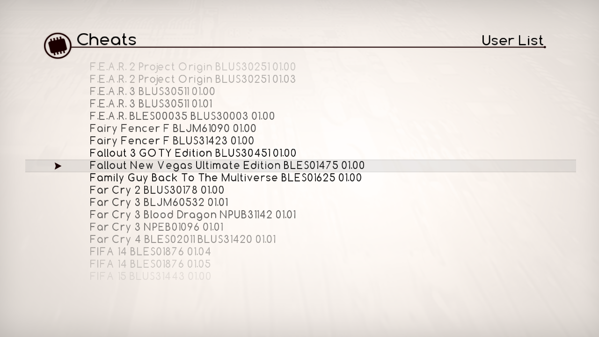
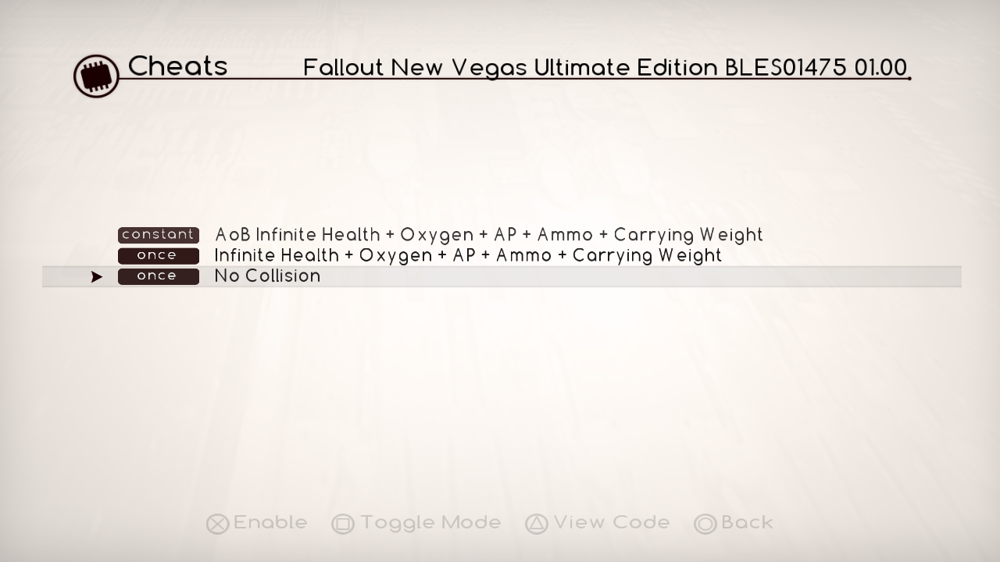

# ArtemisPS3
An Open Source Playstation 3 Hacking System created under the Project Artemis initiative (http://www.gamehacking.org/artemis)

Note
-----------
The Artemis PS3 package file will no longer be held within the repository browser.
It has been moved to [Releases](https://github.com/Dnawrkshp/ArtemisPS3/releases/)

Screenshots
----------

How To Use
----------
Please refer to the [Installation](https://github.com/Dnawrkshp/ArtemisPS3/tree/master/INSTALLATION.md) file for installation and use instructions.

Status
-------

- [X] Install MAMBA and PS3MAPI payload (if not already installed)
- [X] Load artemis_ps3.sprx into VSH
- [X] Access codes from an online database
- [X] Access user codes
- [ ] Allow for users to enter their own codes from Artemis
- [X] Sorts codes and games alphabetically

Credits
-------

    Lazy Bastard    -   Project Founder
    Berion          -   GUI Graphic Designer
    Dnawrkshp       -   Creator of ArtemisPS3-GUI and ArtemisPS3-PRX
    NzV             -   PS3MAPI (on which Artemis is dependant upon)
    PS2Dragon       -   Artemis Logo
    Bucanero        -   Network code
	

Dependancies
------------

    ArtemisPS3-GUI    -   PSL1GHT SDK (github www.github.com/HACKERCHANNEL/)
    ArtemisPS3-PRX    -   CELL SDK

Compiling
-------

This has been built using a makefile and my [VS Integration tools](https://github.com/Dnawrkshp/PS3-VS-Integration).
Ideally, you'd use Visual Studio to run and compile as normal. However the command line will still operate functionally.

For the following, only selfs can be packaged and run.
--
    Visual Studio
      Build           -   Set mode to Debug. Build as normal (F6)
      Run             -   Set mode to Debug. Run as normal (F5)
      Package         -   Set mode to Release. Build as normal (F6)
    Command Line
      Build           -   make
      Run             -   make run
      Package         -   make pkg
	  
  
